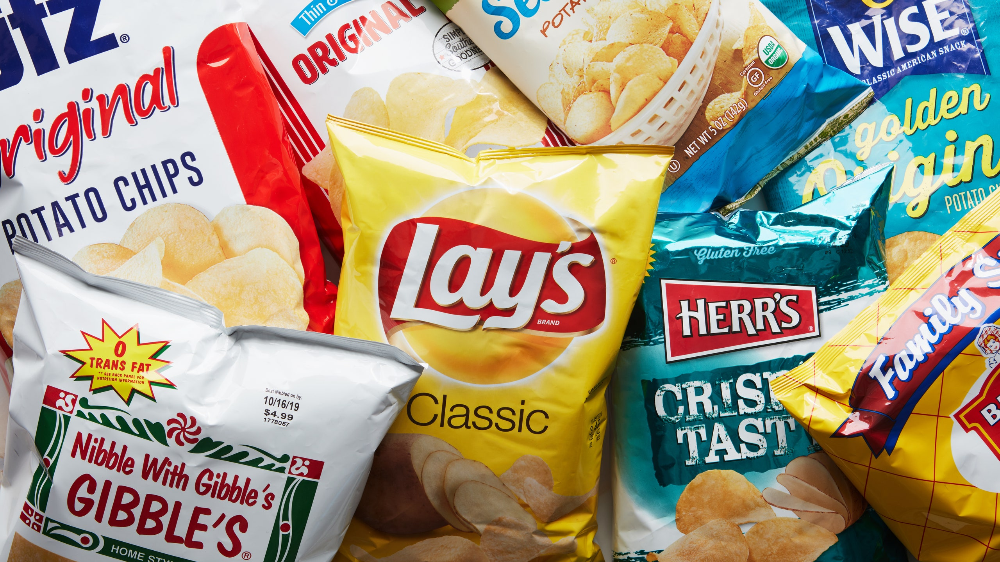
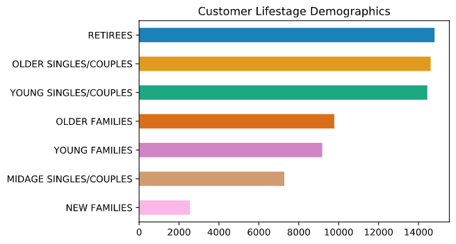
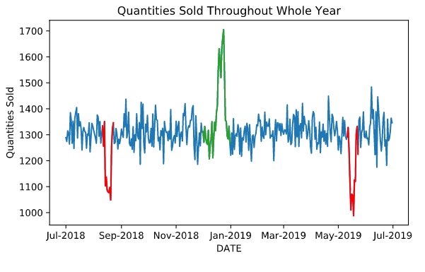
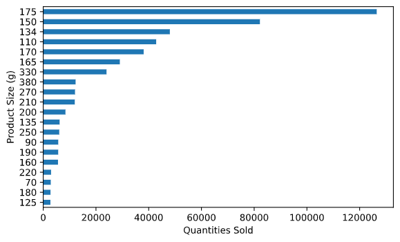
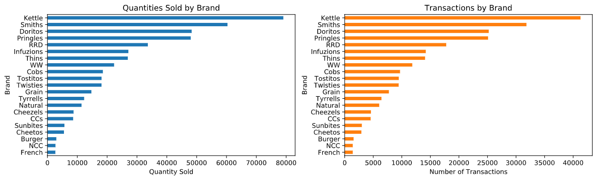
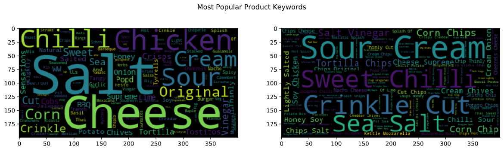
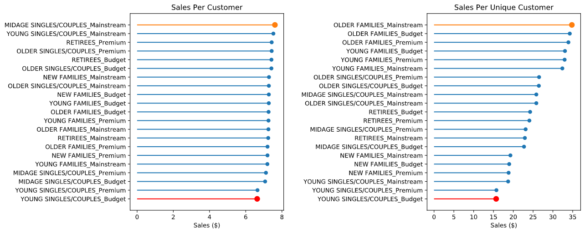
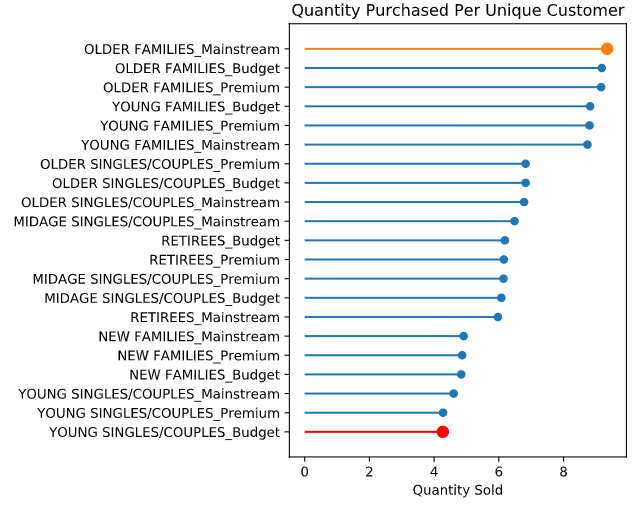
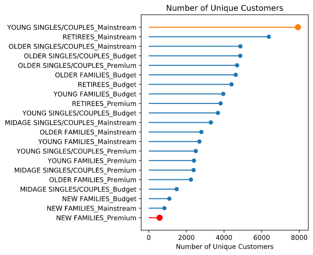
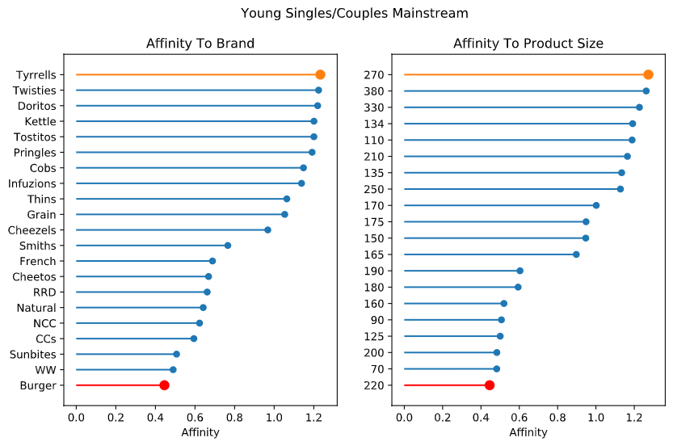

# **Quantium Chips Sales Customer Analytics**

Author: TeYang, Lau  
Last Updated: 26 November 2020

 

### **Please refer to this [notebook](https://www.kaggle.com/teyang/quantium-data-preparation-and-customer-analytics) for a more detailed analysis of the project.** ###

### If it takes a long time to load, the [html file](https://github.com/teyang-lau/Chips_Customer_Segmentation/blob/Master/Customer_Segmentation.html) can also be downloaded. 

 

## Project Goals ##

1. *Explore* customer transaction data and find interesting insights to chips **purchase behavior**
2. *Identify* **customer segments** that contribute to sales
3. *Investigate* which brand and size customers have **affinity** to 

 

## **About this dataset** ##

This data is provided courtesy of [Quantium](https://quantium.com/) via [InsideSherpa's Data Analytics Virtual Experience Program](https://www.insidesherpa.com/virtual-internships/prototype/NkaC7knWtjSbi6aYv/Data%20Analytics%20Virtual%20Experience%20Program). It contains customer segment data as well as customer transaction data on chips purchase.

 

## **EDA** ##

Retirees, older and younger singles and couples are the majority of the customer pool while customer classes are quite evenly split, with more mainstreams followed by budget customers.

 

 

There seems to be an increase in sales during December, possibly due to people stocking up for Christmas. There were also dips around August and May. it appears that **175g** is the most popular size of chips.

 

 

It appears that **Kettle** is the brand that has the highest quantities sold, followed by **Smiths**. **French Fries** and **The Natural Chip Co.** came in last and second last respectively. However, this could be due to some people purchasing more of a certain brand than another brand, which means that having the most quantity sold doesn't mean that it will be the ***most popular\*** among customers. Transactions by brand gives a better idea but it could also be that some people buy lots of a brand in a single transaction.

 

Looking at words and bigrams in the product names, a word cloud suggests that **salt** and **cheese** have the most quantities sold and **sour cream** is the most popular bigram.

 

## Analyses ##

`Sales Per Unique Customer` plot has a higher sales per segment and this is because their are multiple customers who made multiple transactions in the given year. It seems that `Older Families` and `Young Families` pay the most for chips in the given year.

 

`Mainstream Young Singles/Couples` contributed to the most sales (above), have the largest number of customers (bottom right) but tend to purchase lower quantities of chips (bottom left), perhaps this group can be further targeted for more advertisements/recommendations/promotions on certain brands to encourage more purchase and for purchasing slightly more expensive chip brands.

 

 

## Affinity Analysis ##

Using affinity analysis, `Mainstream Young Singles/Couples` tend to buy more `Tyrrells`, `Twisties`, and `Doritos`, and prefer product sizes of `270g` to `380g`. The store can perhaps place more of these products near the shelves that tend to attract younger and mainstream customers.

 

## **Conclusion** ##

* EDA showed that **Kettle** and **Smiths** brand of chips brought in the largest revenue as well as quantities sold
* Products with **Salt** and **Sour Cream** tend to sell the most
* `Mainstream Young Singles/Couples` contributed to one of the highest sales due to their large customer pool but tend to purchase lower quantity of chips, so advertistments/recommendations/promotions can be targeted towards this group to **encourage more purchase**
* `Mainstream Retirees` tend to be the same as `Mainstream Young Singles/Couples`, except that they tend to purchase more chips and slightly cheaper chips. The general strategy would be the same except to **promote cheaper brands** to them.
* `Budget Older Families` also contributed to the most sales, and they tend to buy lots of chips, but there are not as much of them in the customer base. Therefore, the strategy would be to attract more of this segment to **increase the pool size**.
* Market basket analysis **did not provide** any meaningful support/relationship among brands from `Mainstream Young Singles/Couples` customer purchase behavior.
* Affinity analysis suggests that `Mainstream Young Singles/Couples` have affinity towards **Tyrrells** brand and **270g** product size

